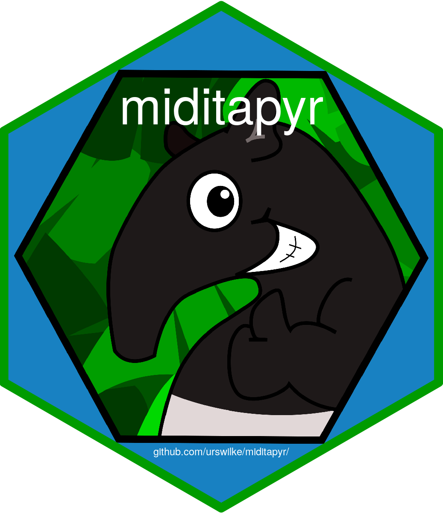

<!-- template from here: https://dbader.org/blog/write-a-great-readme-for-your-github-project -->

# Miditapyr <a href='https://miditapyr.readthedocs.io/'></a>
> MIDI TAbulation in PYthon (and for R)


[](https://badge.fury.io/py/miditapyr)
[](https://travis-ci.org/urswilke/miditapyr)

[](https://codecov.io/gh/urswilke/miditapyr)
[](https://miditapyr.readthedocs.io/en/latest/?badge=latest)

**Work in progress!**

This python package can be used to read in midi files (via
[mido](https://github.com/mido/mido)) in dataframes. These dataframes can then
also be read in in R via the package
[pyramidi](https://github.com/urswilke/pyramidi). The dataframes then can be
easily modified and visualized. Finally they can be written back to midi files
via mido.


## Installation

```sh
pip install miditapyr
```

If you are an R user check out the related R package [pyramidi](https://github.com/urswilke/pyramidi).


## Documentation

Documentation can be found [here](https://miditapyr.readthedocs.io/)

## Usage example

A usage example is shown in a [jupyter notebook in this repo](https://nbviewer.jupyter.org/github/urswilke/miditapyr/blob/master/notebooks/pyramidi_integration.ipynb)
<!-- A few motivating and useful examples of how your product can be used. Spice this up with code blocks and potentially more screenshots.

_For more examples and usage, please refer to the [Wiki][wiki]._ -->

<!-- ## Development setup

Describe how to install all development dependencies and how to run an automated test-suite of some kind. Potentially do this for multiple platforms.

```sh
make install
npm test
``` -->

## Release History

Please find the changelog here: [CHANGELOG.md](https://github.com/urswilke/miditapyr/blob/master/CHANGELOG.md)

## Meta

[Urs Wilke](https://twitter.com/UrsWilke)

Distributed under the MIT license. See [``LICENSE``](https://github.com/urswilke/miditapyr/blob/master/LICENSE) for more information.

## Contributing

1. Fork it (<https://github.com/UrsWilke/miditapyr/fork>)
2. Create your feature branch (`git checkout -b feature/fooBar`)
3. Commit your changes (`git commit -am 'commit message text for fooBar'`)
4. Push to the branch (`git push origin feature/fooBar`)
5. Create a new Pull Request

<!-- Markdown link & img dfn's -->
<!-- [npm-image]: https://img.shields.io/npm/v/datadog-metrics.svg?style=flat-square
[npm-url]: https://npmjs.org/package/datadog-metrics
[npm-downloads]: https://img.shields.io/npm/dm/datadog-metrics.svg?style=flat-square
[travis-image]: https://img.shields.io/travis/dbader/node-datadog-metrics/master.svg?style=flat-square
[travis-url]: https://travis-ci.org/dbader/node-datadog-metrics
[wiki]: https://github.com/yourname/yourproject/wiki -->
